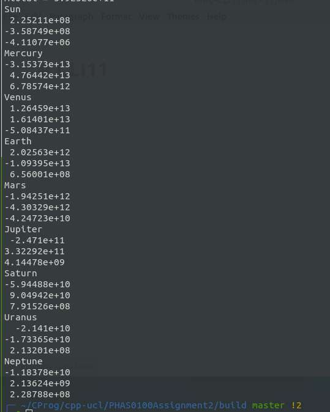

PHAS0100Assignment2
------------------

## Build and Run

#### Using CMAKE and MAKEFILE to compile program

```
mkdir build
cd build
cmake ..
make -j4
```

#### Using CTEST to test correctness

```
ctest
```

the results should be

```
❯ ctest
Test project /home/tropping/CProg/cpp-ucl/PHAS0100Assignment2/build
    Start 1: NoArgs
1/3 Test #1: NoArgs ...........................   Passed    0.00 sec
    Start 2: 1File
2/3 Test #2: 1File ............................   Passed    0.00 sec
    Start 3: SolarTest
3/3 Test #3: SolarTest ........................   Passed    0.43 sec

100% tests passed, 0 tests failed out of 3

Total Test time (real) =   0.45 sec

```

#### Testing Solar System Simulator 

```
❯ ./bin/solarSystemSimulator
```

Expected output:

```
❯ ./bin/solarSystemSimulator
Sun
 2.24622e+07
-3.59523e+07
     -409040
Mercury
-3.15416e+12
 4.76552e+12
 6.78703e+11
Venus
 1.26497e+12
 1.61415e+12
-5.08634e+10
Earth
 2.02418e+11
-1.09416e+12
 6.56107e+07
Mars
-1.94388e+11
-4.30279e+11
-4.24283e+09
Jupiter
-2.46602e+10
 3.32954e+10
 4.13088e+08
Saturn
-5.90437e+09
 9.08739e+09
 7.68755e+07
Uranus
-2.17094e+09
 -1.7081e+09
 2.18026e+07
Neptune
-1.17952e+09
 2.44949e+08
 2.21375e+07
rcom =
 -38.5867
  20.6385
-0.417103
ptotal =
-724743
 387636
-7834.1
mtotal = 5.92326e+11
CPU time used: 7.01 s
Wall clock time passed: 1.78 s

```


#### Result screenshot




### Timestep and Runtime Trade-off & Parallel Speedup

**Machine Info:** 

* CPU: Intel(R) Core(TM) i5-4590 CPU @ 3.30GHz, with 4 cores
* Memory: 12GB
* OMP_NUM_THREADS=4

| Time Step (year) | CPU Time(s) | Wall Clock Time(s) |           Final $r_{com}$            |        Final $p_{total}$        | Parallel CPU Time(s) | Parallel Wall Clock Time(s) | Speedup |
| :--------------: | ----------- | ------------------ | :----------------------------------: | :-----------------------------: | -------------------- | --------------------------- | ------- |
|     0.000274     | 0.45571     | 0.45583            | -38.5899<br />20.6402<br />-0.417136 | -724743<br/> 387636<br/>-7834.1 | 0.75                 | 0.20                        | 2.27    |
|    0.0000274     | 4.56640     | 4.56655            | -38.5867<br/>  20.6385<br/>-0.417103 | -724743<br/> 387636<br/>-7834.1 | 7.03                 | 1.78                        | 2.56    |
|    0.00000274    | 46.45       | 46.46              | -38.5861<br/>  20.6382<br/>-0.417096 | -724743<br/> 387636<br/>-7834.1 | 71.41                | 18.22                       | 2.54    |
|     0.000001     | 124.86      | 124.92             | -38.5861<br/>  20.6382<br/>-0.417095 | -724743<br/> 387636<br/>-7834.1 | 199.12               | 51.27                       | 2.43    |
|    0.0000005     | 259.18      | 259.24             | -38.586<br/>  20.6382<br/>-0.417095  | -724743<br/> 387637<br/>-7834.1 | 423.61               | 113.09                      | 2.29    |

